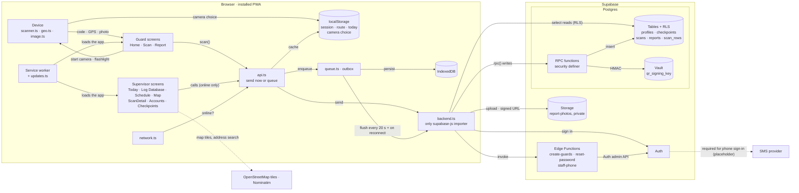
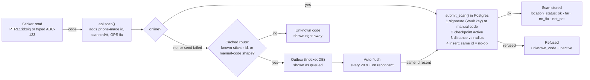
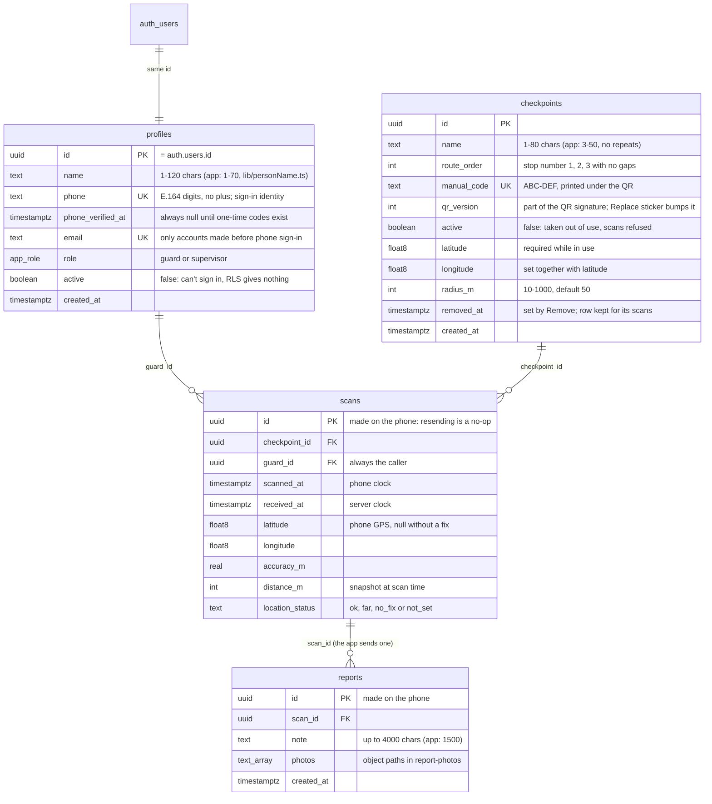
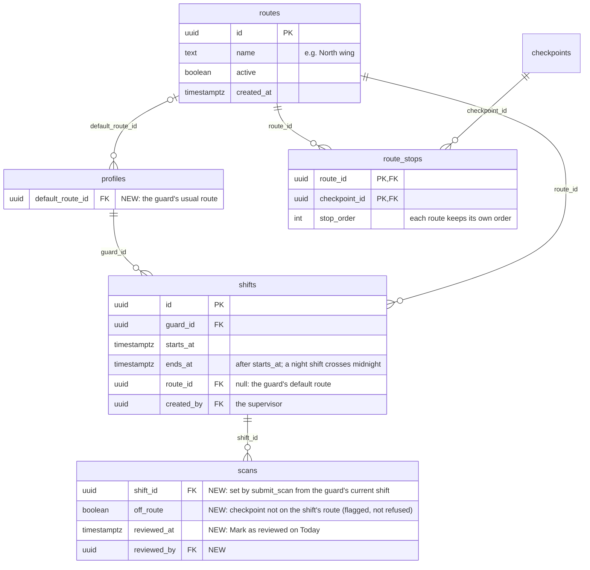

# Patroli architecture

Machine-readable companion to `ARCHITECTURE.pdf`. This file is meant to be read by people and by LLM coding agents: every component names its file, and every edge names the call that makes it. The PDF predates the October 2026 redesign; where they differ, this file is current (the PDF lacks the Today rules, the scanner's camera choice, the database diagrams and sections 3.3 to 3.4 and 7).

Patroli is a QR checkpoint patrol logger. Guards scan QR stickers on their round, often in places with no signal (basements, stairwells). Supervisors read the log, manage checkpoints and create accounts from a desk or a phone. The app is a Preact PWA with no server of its own. It talks directly to Supabase (Postgres, Auth, Storage, Edge Functions).

## 1. Components

### Browser (installed PWA)

| Id | Component | File(s) | Responsibility |
| --- | --- | --- | --- |
| `device` | Device access | `src/lib/scanner.ts`, `src/lib/geo.ts`, `src/lib/image.ts` | Camera and QR decode (qr-scanner). Picks the back camera that has the flash and switches the flashlight (torch). GPS fix kept fresh while the scan screen is open. Shrinks photos (from the camera or the gallery) before upload |
| `guard_ui` | Guard screens (phone only) | `src/pages/guard/Home.tsx`, `Scan.tsx`, `Report.tsx` | Home: greeting, progress bar, next checkpoint, the round. Scan: full camera view, flashlight, typed-code fallback, result with the next checkpoint. Report: note (up to 1,500 characters, about 200 words) and up to 5 photos |
| `sup_ui` | Supervisor screens (phone to wide desktop) | `src/pages/supervisor/*.tsx`, `src/components/SupervisorShell.tsx`, `src/components/ReasonChip.tsx`, `src/lib/today.ts` | Today (four live sections, rules in `today.ts`), Log Database (paged, with the same flags as Today's Needs review via `ReasonChip`), Schedule (sample data), ScanDetail ("View report"), Map (can open on one checkpoint), Accounts (`Guards.tsx`), Checkpoints and QR (`Checkpoints.tsx`, `RouteTable.tsx`; PDF sheet via `src/lib/labelsPdf.ts`), More |
| `router` | Routing and role gates | `src/app.tsx`, `src/state.tsx` | Hash routes (`#/scan`); `RequireRole` sends each role to its own home; app context holds `user` and language |
| `network` | Online state | `src/data/network.ts` | `navigator.onLine` plus `online`/`offline` events |
| `api` | Data facade | `src/data/api.ts` | The only data module screens import. Decides: send now, or park in the outbox. Caches session, route and today's scans. Runs background sync |
| `local_cache` | localStorage | keys `patrol-session-v1`, `patrol-route-v1`, `patrol-today-v1`, `patrol-lang`, `patrol-theme`, `patrol-scan-camera` | Offline copies for display, screen choices, and this phone's camera choice (a back camera's deviceId, or `none`). Not trusted by the server |
| `outbox` | Offline outbox | `src/data/queue.ts` | Queued scans and reports. In-memory copy, saved to IndexedDB strictly in order |
| `idb` | IndexedDB | via `idb-keyval`, store `patroli/outbox` | Durable outbox storage (large enough for photos). Falls back to localStorage if IndexedDB is unavailable |
| `backend` | Supabase adapter | `src/data/backend.ts`, `src/supabaseClient.ts`, `database.types.ts` | The only file that imports supabase-js. Throws `ServerError` when the server answered and refused; any other throw means "unreachable" |
| `sw` | Service worker + updates | `vite.config.ts` (vite-plugin-pwa), `src/lib/updates.ts` | Precaches the app shell so it opens offline (Leaflet and pdf-lib chunks excluded). New versions wait and are switched in only on a safe screen, after the outbox has been saved |

### Supabase

| Id | Component | Where defined | Responsibility |
| --- | --- | --- | --- |
| `auth` | Supabase Auth | dashboard + `supabase/config.toml` | Sessions, sign-in with phone number and password. Public sign-up is off: accounts are created only by supervisors |
| `rpc` | RPC functions (`security definer`) | `supabase/migrations/*.sql` | Every write. Each function checks the caller's role. Examples: `submit_scan`, `submit_report`, `create_checkpoint` (a location is required), `update_checkpoint`, `move_checkpoint`, `reissue_checkpoint`, `remove_checkpoints`, `set_checkpoint_location` (moves a pin, can't clear it), `set_account_active`, `qr_payload`, `route_checkpoints`, `guard_summaries`, `missed_checkpoints`. Helper `private.renumber_round()` keeps stop numbers 1, 2, 3… |
| `tables` | Tables + Row Level Security | `supabase/migrations/20260923120000_patrol_schema.sql` and later | `profiles`, `checkpoints`, `scans`, `reports`; view `scan_rows` (`security_invoker`). RLS: guards read only their own rows, supervisors read everything. No table accepts direct writes from the app. Diagram: 3.3 |
| `vault` | Vault secret `qr_signing_key` | schema migration | HMAC key for QR stickers. Never leaves the database |
| `storage` | Storage bucket `report-photos` | schema migration | Private. Guards upload to `<user id>/<report id>/`; supervisors and owners read via signed URLs |
| `edge` | Edge Functions | `supabase/functions/create-guards`, `reset-password`, `staff-phone`, `_shared/supervisor.ts`, `_shared/phone.ts`, `_shared/names.ts` | Hold the service-role key. Each calls `requireSupervisor` first, then uses the Auth admin API |

The two newest migrations (`20260930120000_checkpoint_location_required.sql`, `20260930130000_contiguous_stop_numbers.sql`) run locally but not yet on the hosted project (README > Status and TODO > Launch).

### External

| Id | Component | Used by | Notes |
| --- | --- | --- | --- |
| `osm` | OpenStreetMap tiles (Leaflet), Nominatim search | `src/lib/map.ts`, `src/lib/geocode.ts` | Supervisor Map and Checkpoints only. Called directly from the browser, not through `backend.ts`. Leaflet is excluded from the guard's precache |
| `sms` | SMS provider (Twilio, MessageBird, Vonage or Textlocal) | Supabase Auth, set in the dashboard | Supabase requires one to allow phone sign-in at all. Currently placeholder values: nothing is ever texted (one-time codes are a TODO) |

## 2. Edges

Format: `from -> to : what flows / which call`.

```text
guard_ui    -> device      : startScanner() (opens the back camera with a flash), setFlash(on), watchLocation(), compressImage()
device      -> guard_ui    : decoded QR text or typed manual code, GPS fix, shrunk photo (data URL)
device      -> local_cache : the chosen back camera (patrol-scan-camera), so the search runs once per phone
sw          -> guard_ui    : serves the cached app shell (works offline)
sw          -> sup_ui      : serves the cached app shell
guard_ui    -> api         : scan(), addReport(), todayProgress() (home, and the Scan result's next checkpoint), loadRoute()
sup_ui      -> api         : listScans(), exportScans(), getScan(), allCheckpoints(), guardSummaries(), createGuards(), ... (wrapped in needsNetwork: throw "offline" if no signal)
network     -> api         : isOnline(), onNetworkChange()
api         -> local_cache : read/write session, route, today's scans
api         -> backend     : online -> send now
api         -> outbox      : offline, or backend threw a non-ServerError -> enqueue()
outbox      -> idb         : persist every change, in order
outbox      -> backend     : flushOutbox(), triggered every 20 s and on the "online" event (startAutoSync)
backend     -> auth        : signInWithPassword (phone number + password), onAuthStateChange
backend     -> rpc         : supabase.rpc(...) for every write and some reads
backend     -> tables      : supabase.from(...).select() reads, filtered by RLS
backend     -> storage     : upload report photos; createSignedUrls to view them
backend     -> edge        : supabase.functions.invoke("create-guards" | "reset-password" | "staff-phone")
rpc         -> tables      : insert / update, after checking the caller
rpc         -> vault       : HMAC sign (qr_payload) and verify (submit_scan)
edge        -> auth        : auth.admin.createUser / updateUserById (phone, password; service-role key);
edge        -> tables      : insert profiles rows; update phone, phone_verified_at
sup_ui      -> osm         : map tiles, address search (on "Search" only)
```

## 3. Diagrams

### 3.1 System map



### 3.2 One scan



### 3.3 Database schema (current)

All four tables have Row Level Security on and accept no direct writes (invariant 3). Limits in brackets are the database's; the app is stricter where noted.



- View `scan_rows` (`security_invoker`): each scan with `guard_name`, `checkpoint_name`, its first report as JSON, and the checkpoint's current position and radius. Every supervisor list, the CSV export and Today read it.
- Constraints worth knowing: `checkpoints_location_complete` (latitude and longitude together), `checkpoints_location_required` (a location unless removed), `profiles_phone_or_email`.
- Storage: bucket `report-photos`, private, `<guard id>/<report id>/<file>`.

### 3.4 Planned schema (not built)

Proposal for per-guard checkpoints and shifts at one site. Nothing here exists yet; it waits on the owner's answers listed in README > Status and TODO > Not decided yet. New and changed parts only.



Notes for whoever builds it:

- `route_checkpoints()` would return the caller's current shift's route instead of every active checkpoint. The guard app caches it like today (`patrol-route-v1`), and should also cache the guard's shifts so the right round shows offline.
- `remove_checkpoints()` must also delete the checkpoint's `route_stops`. Stickers don't change: a QR names a checkpoint, not a route.
- `checkpoints.route_order` then becomes only the master list's order (Checkpoints page), or is dropped.
- Several sites would add a `sites` table and `site_id` on profiles (or a membership table), checkpoints, routes and shifts. Keep that in mind in every new RLS policy.

## 4. Key flows

### 4.1 Scan (`api.scan` -> `backend.submitScan` -> `submit_scan()`)

1. `api.scan(code, guardId, location?)` builds a `PendingScan` with `id = newId()` (made on the phone), `scannedAt` from the phone clock, and the GPS fix if one is less than 60 s old.
2. If online, `backend.submitScan` calls the `submit_scan` RPC.
   - `{ ok: true }`: remembered in the today cache; screen shows success.
   - `{ ok: false, reason }` (`unknown_code`, `inactive`): shown to the guard, not queued.
   - `ServerError` thrown: the server answered and refused; returns `server_error`, not queued.
   - Any other throw: treated as unreachable; falls through to the offline path.
3. Offline path: `localLookup` checks the code against the cached route (`PTRL1:<id>` prefix). If the code is neither a known sticker nor shaped like a manual code (`^[A-Z0-9]{3}-?[A-Z0-9]{3}$`), return `unknown_code`. Otherwise enqueue it.
4. Server side, `submit_scan`:
   - Requires the caller to be a guard. If a scan with this id exists, returns it (idempotent).
   - QR form `PTRL1:<uuid>:<sig>`: the checkpoint must exist and `sig` must equal `private.qr_signature(id, qr_version)` (HMAC with the Vault key). Otherwise the code is matched against `manual_code`.
   - Checkpoint must be `active`.
   - Location status: `no_fix` (no usable GPS), `not_set` (checkpoint not pinned; only on scans from before every checkpoint needed a location), `ok` (within `radius_m + min(accuracy, 100)` metres), else `far`. Far scans are flagged, never rejected.
   - `insert ... on conflict (id) do nothing`. `guard_id` is always `auth.uid()`.
5. The result screen then reads `api.todayProgress()` (works offline) to name the next checkpoint in the round.

### 4.2 Report with photos (`api.addReport` -> `backend.submitReport`)

The guard writes a note (the textarea stops at 1,500 characters; the database allows 4,000) and adds up to 5 photos: "Take photo" is a file input with `capture="environment"` (opens the camera; newer Android shows a gallery-only picker for a plain input), "From gallery" a plain one. Photos are shrunk on the phone (`compressImage`) and stay as data URLs on the phone and in the outbox. When sent, `backend.submitReport` uploads each photo to `report-photos/<user id>/<report id>/`, then calls `submit_report()` with the object paths. A report is queued if offline, if sending fails, or if its scan is still in the outbox.

### 4.3 Outbox flush (`api.flushOutbox`)

Runs from `startAutoSync()`: on every `online`/`offline` event and every 20 s while items are queued. Only one flush runs at a time. Items are sent oldest first:

- Items queued by another guard on the same phone are skipped until that guard signs in.
- Scan accepted: removed. Scan refused (`ok: false`): removed and counted as rejected; its reports are dropped.
- `ServerError`: the item stays, with the error recorded (`markFailed`), so the guard sees a reason and can Try again or Discard.
- Network error: stop and wait for the next tick.

### 4.4 Startup (`src/main.tsx`)

`loadOutbox()` (moves any legacy localStorage outbox into IndexedDB) -> `startAutoSync()` -> `startUpdates()` -> `startTooltips()` -> render. The outbox must be in memory before any screen reads it.

### 4.5 Accounts

Everyone signs in with a phone number and a password. Nobody can sign up: `[auth] enable_signup = false`, and access needs a `profiles` row, which only the Edge Functions create.

A supervisor calls `create-guards`, `reset-password` or `staff-phone` through `supabase.functions.invoke`. The function validates the caller with `requireSupervisor` (401 if not signed in, 403 if not an active supervisor), then uses the service-role client.

- `create-guards` makes Auth users keyed on the phone number (stored as digits with country code, e.g. `6281234567890`; typed numbers are normalised by `normalizePhone`, kept in step in `src/lib/phone.ts` and `supabase/functions/_shared/phone.ts`) with generated passwords, plus `profiles` rows. Passwords are returned once and never texted.
- Confirming a number with a one-time code is not built yet (TODO). The UI is shown but disabled, and `profiles.phone_verified_at` stays null. A working version is in commit `947b3c6`.
- `staff-phone` `change` gives someone a new number (Auth and `profiles` together); the new number starts unconfirmed.

`set_account_active()` deactivates an account so its sessions get nothing. Accounts made before phone sign-in keep `profiles.email` and have no phone until one is added.

### 4.6 Today dashboard (`pages/supervisor/Today.tsx`, rules in `src/lib/today.ts`)

One fetch feeds all four sections: `allCheckpoints()`, `exportScans({ date: today })` and `guardSummaries(today)`, where "today" is the supervisor's device's calendar day (`localDateKey`). The page fetches again every 60 s while it's on screen, as soon as it's back on screen if a refresh was missed, and on the Refresh button. The rules are pure functions with unit tests (`tests/today.test.mjs`); thresholds live in one `REVIEW` constant.

- **Completed** / **Not yet visited** (`todayCheckpoints`): checkpoints in use, split by whether anyone scanned them today; a far scan still completes a checkpoint. Each not-yet-visited checkpoint has a map-pin link to `#/supervisor/map/checkpoint/:id`; the browser's Back returns to Today.
- **Needs review** (`needsReview`): today's scans, newest first, each with every reason that applies: far, no GPS, has a report (note or photos), sent late (received more than 60 min after scanning), too fast (the same guard's previous scan was another checkpoint less than 1 min earlier; the later scan is flagged). Not flagged on purpose: no report, checkpoint not pinned.
- **Guards on duty** (`guardsOnDuty`): every active guard, Patrolling (scanned within 60 min), Quiet (earlier today) or Not started; sorted in that order, then by name.

The Log Database applies `needsReview` to each page of scans for its Flags column, without "too fast" (that compares a scan with the guard's previous one, which may be on another page).

### 4.7 Scanner camera and flashlight (`src/lib/scanner.ts`)

Asked for "the back camera", Chrome on Android often opens a secondary lens (wide-angle or macro) that has no flash and focuses worse. `startScanner` therefore checks `hasFlash()` on the camera it opened; if there's none, it tries the other back cameras once (`QrScanner.listCameras`, labels matching back/rear) and remembers the first with a flash in `patrol-scan-camera`. If none has one, it stores `none` so the search isn't repeated (iPhones, laptops). A remembered camera that has gone triggers a new search.

The flashlight button (`setFlash`) uses the camera track's `torch` setting: Chromium browsers on Android with a flash. iPhone browsers (all WebKit), Firefox and desktop webcams report no torch; the button is then shown disabled.

## 5. Invariants

Changes that break one of these are architectural changes.

1. Screens import `src/data/api.ts` for data, never `backend.ts` or supabase-js.
2. Only `src/data/backend.ts` (and `src/supabaseClient.ts`) import supabase-js.
3. The app never writes a table directly. Every write is a `security definer` RPC that checks the caller, or an Edge Function that checks for a supervisor.
4. Reads rely on RLS: guards see only their own profile, scans and reports; supervisors see everything. Guards never see manual codes.
5. The QR signing key stays in Vault. The service-role key exists only in Edge Functions.
6. Scan ids are made on the phone, so resending is harmless (idempotent insert).
7. `scannedAt` is the phone's clock; `receivedAt` is the server's.
8. Supervisor features require a connection (`needsNetwork`); only the guard flow works offline.
9. `localStorage` caches are for display only; nothing on the server trusts them.
10. A new app version reloads only on a screen with nothing to type, and only after `outboxSaved()` resolves.
11. Every checkpoint in use has a location (`checkpoints_location_required`). A pin can be moved, never cleared: to drop a location, remove the checkpoint.

## 6. Routes (`src/app.tsx`, hash routing)

| Route | Role | Screen |
| --- | --- | --- |
| `#/login` | none | `pages/Login.tsx` |
| `#/` | guard | `pages/guard/Home.tsx` (today's round) |
| `#/scan` | guard | `pages/guard/Scan.tsx` |
| `#/report/:scanId` | guard | `pages/guard/Report.tsx` |
| `#/supervisor` | supervisor | `pages/supervisor/Today.tsx` (Today tab: the start page) |
| `#/supervisor/log` | supervisor | `pages/supervisor/Log.tsx` (Log Database tab) |
| `#/supervisor/schedule` | supervisor | `pages/supervisor/Schedule.tsx` (Schedule tab, sample data for now) |
| `#/supervisor/map` | supervisor | `pages/supervisor/MapView.tsx` |
| `#/supervisor/map/checkpoint/:id` | supervisor | `pages/supervisor/MapView.tsx`, opened on one checkpoint with its popup showing (the map-pin links in Today's Not yet visited; Back returns to Today) |
| `#/supervisor/guards` | supervisor | `pages/supervisor/Guards.tsx` (Accounts tab) |
| `#/supervisor/checkpoints` | supervisor | `pages/supervisor/Checkpoints.tsx` |
| `#/supervisor/scans/:id` | supervisor | `pages/supervisor/ScanDetail.tsx` |
| `#/supervisor/more` | supervisor | `pages/supervisor/More.tsx` (More in the phone tab bar: Accounts, Checkpoints, Sign out) |

## 7. UI: conventions, redesign status and next steps

### 7.1 Conventions

- **One stylesheet, mobile first:** `src/index.css`, component classes in `@layer components`. Phone below 640 px, tablet 640-1023 px, desktop from 1024 px, wide desktop from 1280 and 1440 px. Layout changes happen in CSS; `useMediaQuery` (`src/hooks.ts`) only where behaviour differs (Checkpoints: the add form is a dialog on desktop).
- **Colour:** tokens on `:root` with dark versions (`prefers-color-scheme` and `data-theme`). Blue (`--info`) for actions and selection: `.shell`, `.login-page`, `.guard-home`, `.scan-screen`, `.scan-done` and `.report-page` point `--accent` at `--info`. Amber and yellow only for warnings (`--warn`, `--queued`, `--review`); green (`--done`) for done.
- **Touch:** `@media (pointer: coarse)` gives every control a 44 px target; mouse users keep compact sizes.
- **Date fields on phones:** Android Chrome and iPhone Safari show an empty `<input type="date">` blank, and Android gives it almost no width. A date filter that can be empty uses the Log's `.date-chip`: a minimum width, and a "dd/mm/yyyy" hint (`datePlaceholder`) on touch screens only, since desktop browsers show their own.
- **Images:** the unlayered `img { max-width: 100% }` beats layered rules, so image sizes use `width: min(...)`.
- **Who uses what:** guard screens are phone-only (one column, at most 36rem wide); supervisor screens run from phone to wide desktop (bottom tab bar below 1024 px, top tabs above).
- **Design reference:** the Patroli design canvas (phone and desktop boards: `GuardHome`, `Scan`, `ScanDone`, `Report`, `TopBar`, `DeskToday`, `DeskSchedule`, `DeskLogs`, `DeskMap`, `DeskAccounts` and the multi-site `MS*` boards). It lives outside the repo; ask the project owner for access.

### 7.2 Redesign status by screen

| Screen | File(s) | Status | Next step |
| --- | --- | --- | --- |
| Sign in | `pages/Login.tsx` | Done | - |
| Guard home | `pages/guard/Home.tsx` | Done | With shifts: show the current shift under the date (the design's "Morning shift") and only the guard's assigned checkpoints |
| Guard top bar | `components/LanguageBar.tsx` (`.lang-bar`, shown by `PageLanguageBar` in `app.tsx`) | Done: "Patroli" on the left, the switches on the right; also on Sign in | - |
| Scan | `pages/guard/Scan.tsx` | Done | Check the flashlight on a real iPhone; an animated scan line is optional |
| Report | `pages/guard/Report.tsx` | Done | - |
| Today | `pages/supervisor/Today.tsx` | Done | Per shift once shifts exist; "Late start" status; "Mark as reviewed"; Supabase Realtime instead of polling |
| Checkpoints and QR | `pages/supervisor/Checkpoints.tsx`, `RouteTable.tsx` | Done | With per-guard routes: a way to build routes and see which routes include a checkpoint |
| More | `pages/supervisor/More.tsx` | Done | - |
| Schedule | `pages/supervisor/Schedule.tsx` | Partly: the grid follows `DeskSchedule`, with sample data | Heading like Today (`.dash-title`); shift chips in the blue palette (Night is black); week navigation; an Add shift dialog; a route per shift. Needs the 3.4 tables first |
| Log Database | `pages/supervisor/Log.tsx` | Done: pill filters (the date chip shows "dd/mm/yyyy" on phones), flags as on Today, rows open the scan, one line per scan on phones | The design's search box and "Any flag" filter (server-side, so paging and CSV work); one filter bar shared with Map (date range, location status) |
| Map | `pages/supervisor/MapView.tsx` | Not started | Heading and filter bar like the other pages (shared with Log; its date starts on today, and as a pill it should reuse `.date-chip`); legend as chips (`DeskMap`, `Map` boards) |
| Accounts | `pages/supervisor/Guards.tsx`, `AccountsTable.tsx` | Not started (only the buttons turned blue) | Cards like Checkpoints; a phone layout for the table (`DeskAccounts`, `Accounts` boards) |
| Scan detail (View report) | `pages/supervisor/ScanDetail.tsx` | Done: location pill, Scan and Report cards, photos open full size; Back returns to where it was opened from | With Mark as reviewed: the button lives here |
| Not found | `app.tsx` | Not started (one line of text) | A small empty state with a link home |

### 7.3 Planned features: where to start

- **Shifts and the Schedule page.** Migration with `shifts` (3.4) and RLS (a guard reads their own); supervisor-checked RPCs to add, edit, copy a week and remove shifts; `backend.ts` and `api.ts` functions; the Schedule page; then Today per shift, the guard home's shift line, and an offline cache of the guard's shifts.
- **Per-guard checkpoints.** `routes` and `route_stops` (3.4); `route_checkpoints()` returns the current shift's route; the guard home counts only assigned checkpoints; Today's Not yet visited per guard; an "Off route" reason in Needs review.
- **Mark as reviewed.** `scans.reviewed_at` / `reviewed_by` and an RPC; the button on View report (`ScanDetail.tsx`); Today hides reviewed scans (or shows them greyed).
- **Log search and flag filter.** The design's search box (guard or checkpoint name, report text) and "Any flag" filter. Both must filter on the server (`scanRowsQuery` in `backend.ts`: `ilike` on `scan_rows`, or a full-text index; flags as columns or a view) so paging and the CSV export agree. Then one filter bar shared with the Map.
- **Report photos that can't be read.** `addFiles` in `Report.tsx` skips them silently; show a short notice.
- **Live Today.** Supabase Realtime on `scans`, subscribed in `backend.ts` (invariant 2), keeping the 60 s refresh as a fallback.
- **Several sites.** Later: see 3.4's last note and README > Status and TODO > Not decided yet.
- **One-time codes.** README > Status and TODO > Launch.
