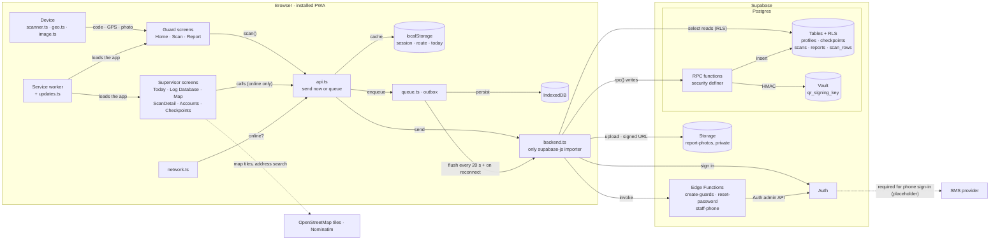
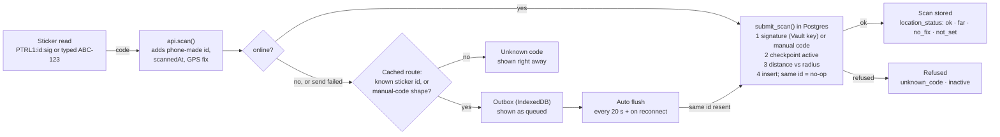

# Patroli architecture

Machine-readable companion to `ARCHITECTURE.pdf`. Both describe the same system. This file is meant to be read by people and by LLM coding agents: every component names its file, and every edge names the call that makes it.

Patroli is a QR checkpoint patrol logger. Guards scan QR stickers on their round, often in places with no signal (basements, stairwells). Supervisors read the log, manage checkpoints and create accounts from a desk. The app is a Preact PWA with no server of its own. It talks directly to Supabase (Postgres, Auth, Storage, Edge Functions).

## 1. Components

### Browser (installed PWA)

| Id | Component | File(s) | Responsibility |
| --- | --- | --- | --- |
| `device` | Device access | `src/lib/scanner.ts`, `src/lib/geo.ts`, `src/lib/image.ts` | Camera and QR decode (qr-scanner), GPS fix kept fresh while the scan screen is open, shrinking photos before upload |
| `guard_ui` | Guard screens | `src/pages/guard/Home.tsx`, `Scan.tsx`, `Report.tsx` | Today's round, scanning, incident report with photos |
| `sup_ui` | Supervisor screens | `src/pages/supervisor/*.tsx`, `src/components/SupervisorShell.tsx` | Log (paged), ScanDetail, Map, Accounts (`Guards.tsx`), Checkpoints |
| `router` | Routing and role gates | `src/app.tsx`, `src/state.tsx` | Hash routes (`#/scan`); `RequireRole` sends each role to its own home; app context holds `user` and language |
| `network` | Online state | `src/data/network.ts` | `navigator.onLine` plus `online`/`offline` events |
| `api` | Data facade | `src/data/api.ts` | The only data module screens import. Decides: send now, or park in the outbox. Caches session, route and today's scans. Runs background sync |
| `local_cache` | localStorage | keys `patrol-session-v1`, `patrol-route-v1`, `patrol-today-v1`, `patrol-lang` | Offline copies for display and screen choice. Not trusted by the server |
| `outbox` | Offline outbox | `src/data/queue.ts` | Queued scans and reports. In-memory copy, saved to IndexedDB strictly in order |
| `idb` | IndexedDB | via `idb-keyval`, store `patroli/outbox` | Durable outbox storage (large enough for photos). Falls back to localStorage if IndexedDB is unavailable |
| `backend` | Supabase adapter | `src/data/backend.ts`, `src/supabaseClient.ts`, `database.types.ts` | The only file that imports supabase-js. Throws `ServerError` when the server answered and refused; any other throw means "unreachable" |
| `sw` | Service worker + updates | `vite.config.ts` (vite-plugin-pwa), `src/lib/updates.ts` | Precaches the app shell so it opens offline. New versions wait and are switched in only on a safe screen, after the outbox has been saved |

### Supabase

| Id | Component | Where defined | Responsibility |
| --- | --- | --- | --- |
| `auth` | Supabase Auth | dashboard + `supabase/config.toml` | Sessions, sign-in with phone number and password. Public sign-up is off: accounts are created only by supervisors |
| `rpc` | RPC functions (`security definer`) | `supabase/migrations/*.sql` | Every write. Each function checks the caller's role. Examples: `submit_scan`, `submit_report`, `create_checkpoint`, `update_checkpoint`, `move_checkpoint`, `reissue_checkpoint`, `remove_checkpoints`, `set_checkpoint_location`, `set_account_active`, `qr_payload`, `route_checkpoints`, `guard_summaries`, `missed_checkpoints` |
| `tables` | Tables + Row Level Security | `supabase/migrations/20260923120000_patrol_schema.sql` and later | `profiles`, `checkpoints`, `scans`, `reports`; view `scan_rows` (`security_invoker`). RLS: guards read only their own rows, supervisors read everything. No table accepts direct writes from the app |
| `vault` | Vault secret `qr_signing_key` | schema migration | HMAC key for QR stickers. Never leaves the database |
| `storage` | Storage bucket `report-photos` | schema migration | Private. Guards upload to `<user id>/<report id>/`; supervisors and owners read via signed URLs |
| `edge` | Edge Functions | `supabase/functions/create-guards`, `reset-password`, `staff-phone`, `_shared/supervisor.ts`, `_shared/phone.ts` | Hold the service-role key. Each calls `requireSupervisor` first, then uses the Auth admin API |

### External

| Id | Component | Used by | Notes |
| --- | --- | --- | --- |
| `osm` | OpenStreetMap tiles (Leaflet), Nominatim search | `src/lib/map.ts`, `src/lib/geocode.ts` | Supervisor Map and Checkpoints only. Called directly from the browser, not through `backend.ts`. Leaflet is excluded from the guard's precache |
| `sms` | SMS provider (Twilio, MessageBird, Vonage or Textlocal) | Supabase Auth, set in the dashboard | Supabase requires one to allow phone sign-in at all. Currently placeholder values: nothing is ever texted (one-time codes are a TODO) |

## 2. Edges

Format: `from -> to : what flows / which call`.

```text
device      -> guard_ui    : decoded QR text or typed manual code, GPS fix, shrunk photo (data URL)
sw          -> guard_ui    : serves the cached app shell (works offline)
sw          -> sup_ui      : serves the cached app shell
guard_ui    -> api         : scan(), addReport(), todayProgress(), loadRoute()
sup_ui      -> api         : listScans(), exportScans(), getScan(), createGuards(), ... (wrapped in needsNetwork: throw "offline" if no signal)
network     -> api         : isOnline(), onNetworkChange()
api         -> local_cache : read/write session, route, today's scans
api         -> backend     : online -> send now
api         -> outbox      : offline, or backend threw a non-ServerError -> enqueue()
outbox      -> idb         : persist every change, in order
outbox      -> backend     : flushOutbox(), triggered every 20 s and on the "online" event (startAutoSync)
backend     -> auth        : signInWithPassword (phone number + password), onAuthStateChange
backend     -> rpc         : supabase.rpc(...) for every write and some reads
backend     -> tables      : supabase.from(...).select() reads, filtered by RLS
backend     -> storage     : upload report photos; createSignedUrls to view them
backend     -> edge        : supabase.functions.invoke("create-guards" | "reset-password" | "staff-phone")
rpc         -> tables      : insert / update, after checking the caller
rpc         -> vault       : HMAC sign (qr_payload) and verify (submit_scan)
edge        -> auth        : auth.admin.createUser / updateUserById (phone, password; service-role key);
edge        -> tables      : insert profiles rows; update phone, phone_verified_at
sup_ui      -> osm         : map tiles, address search (on "Search" only)
```

## 3. Diagrams

### 3.1 System map



### 3.2 One scan



## 4. Key flows

### 4.1 Scan (`api.scan` -> `backend.submitScan` -> `submit_scan()`)

1. `api.scan(code, guardId, location?)` builds a `PendingScan` with `id = newId()` (made on the phone), `scannedAt` from the phone clock, and the GPS fix if one is less than 60 s old.
2. If online, `backend.submitScan` calls the `submit_scan` RPC.
   - `{ ok: true }`: remembered in the today cache; screen shows success.
   - `{ ok: false, reason }` (`unknown_code`, `inactive`): shown to the guard, not queued.
   - `ServerError` thrown: the server answered and refused; returns `server_error`, not queued.
   - Any other throw: treated as unreachable; falls through to the offline path.
3. Offline path: `localLookup` checks the code against the cached route (`PTRL1:<id>` prefix). If the code is neither a known sticker nor shaped like a manual code (`^[A-Z0-9]{3}-?[A-Z0-9]{3}$`), return `unknown_code`. Otherwise enqueue it.
4. Server side, `submit_scan`:
   - Requires the caller to be a guard. If a scan with this id exists, returns it (idempotent).
   - QR form `PTRL1:<uuid>:<sig>`: the checkpoint must exist and `sig` must equal `private.qr_signature(id, qr_version)` (HMAC with the Vault key). Otherwise the code is matched against `manual_code`.
   - Checkpoint must be `active`.
   - Location status: `no_fix` (no usable GPS), `not_set` (checkpoint not pinned), `ok` (within `radius_m + min(accuracy, 100)` metres), else `far`. Far scans are flagged, never rejected.
   - `insert ... on conflict (id) do nothing`. `guard_id` is always `auth.uid()`.

### 4.2 Report with photos (`api.addReport` -> `backend.submitReport`)

Photos stay as data URLs on the phone and in the outbox. When sent, `backend.submitReport` uploads each photo to `report-photos/<user id>/<report id>/`, then calls `submit_report()` with the object paths. A report is queued if offline, if sending fails, or if its scan is still in the outbox.

### 4.3 Outbox flush (`api.flushOutbox`)

Runs from `startAutoSync()`: on every `online`/`offline` event and every 20 s while items are queued. Only one flush runs at a time. Items are sent oldest first:

- Items queued by another guard on the same phone are skipped until that guard signs in.
- Scan accepted: removed. Scan refused (`ok: false`): removed and counted as rejected; its reports are dropped.
- `ServerError`: the item stays, with the error recorded (`markFailed`), so the guard sees a reason and can Try again or Discard.
- Network error: stop and wait for the next tick.

### 4.4 Startup (`src/main.tsx`)

`loadOutbox()` (moves any legacy localStorage outbox into IndexedDB) -> `startAutoSync()` -> `startUpdates()` -> `startTooltips()` -> render. The outbox must be in memory before any screen reads it.

### 4.5 Accounts

Everyone signs in with a phone number and a password. Nobody can sign up: `[auth] enable_signup = false`, and access needs a `profiles` row, which only the Edge Functions create.

A supervisor calls `create-guards`, `reset-password` or `staff-phone` through `supabase.functions.invoke`. The function validates the caller with `requireSupervisor` (401 if not signed in, 403 if not an active supervisor), then uses the service-role client.

- `create-guards` makes Auth users keyed on the phone number (stored as digits with country code, e.g. `6281234567890`; typed numbers are normalised by `normalizePhone`, kept in step in `src/lib/phone.ts` and `supabase/functions/_shared/phone.ts`) with generated passwords, plus `profiles` rows. Passwords are returned once and never texted.
- Confirming a number with a one-time code is not built yet (TODO). The UI is shown but disabled, and `profiles.phone_verified_at` stays null. A working version is in commit `947b3c6`.
- `staff-phone` `change` gives someone a new number (Auth and `profiles` together); the new number starts unconfirmed.

`set_account_active()` deactivates an account so its sessions get nothing. Accounts made before phone sign-in keep `profiles.email` and have no phone until one is added.

## 5. Invariants

Changes that break one of these are architectural changes.

1. Screens import `src/data/api.ts` for data, never `backend.ts` or supabase-js.
2. Only `src/data/backend.ts` (and `src/supabaseClient.ts`) import supabase-js.
3. The app never writes a table directly. Every write is a `security definer` RPC that checks the caller, or an Edge Function that checks for a supervisor.
4. Reads rely on RLS: guards see only their own profile, scans and reports; supervisors see everything. Guards never see manual codes.
5. The QR signing key stays in Vault. The service-role key exists only in Edge Functions.
6. Scan ids are made on the phone, so resending is harmless (idempotent insert).
7. `scannedAt` is the phone's clock; `receivedAt` is the server's.
8. Supervisor features require a connection (`needsNetwork`); only the guard flow works offline.
9. `localStorage` caches are for display only; nothing on the server trusts them.
10. A new app version reloads only on a screen with nothing to type, and only after `outboxSaved()` resolves.

## 6. Routes (`src/app.tsx`, hash routing)

| Route | Role | Screen |
| --- | --- | --- |
| `#/login` | none | `pages/Login.tsx` |
| `#/` | guard | `pages/guard/Home.tsx` (today's round) |
| `#/scan` | guard | `pages/guard/Scan.tsx` |
| `#/report/:scanId` | guard | `pages/guard/Report.tsx` |
| `#/supervisor` | supervisor | `pages/supervisor/Today.tsx` (Today tab: the start page) |
| `#/supervisor/log` | supervisor | `pages/supervisor/Log.tsx` (Log Database tab) |
| `#/supervisor/map` | supervisor | `pages/supervisor/MapView.tsx` |
| `#/supervisor/guards` | supervisor | `pages/supervisor/Guards.tsx` (Accounts tab) |
| `#/supervisor/checkpoints` | supervisor | `pages/supervisor/Checkpoints.tsx` |
| `#/supervisor/scans/:id` | supervisor | `pages/supervisor/ScanDetail.tsx` |
